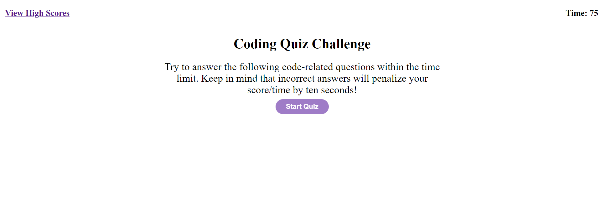
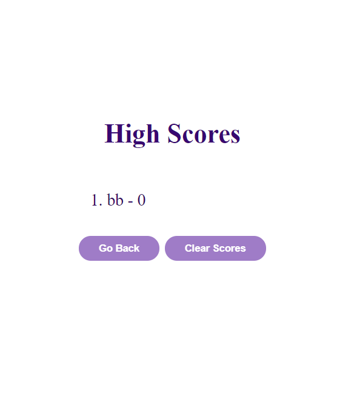
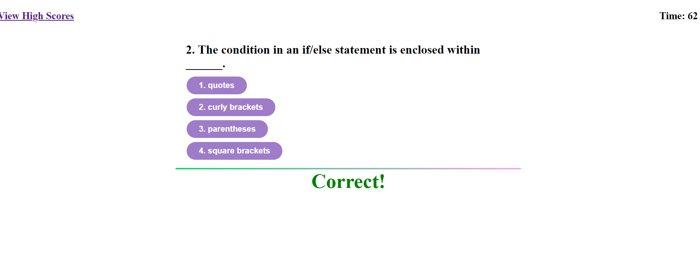
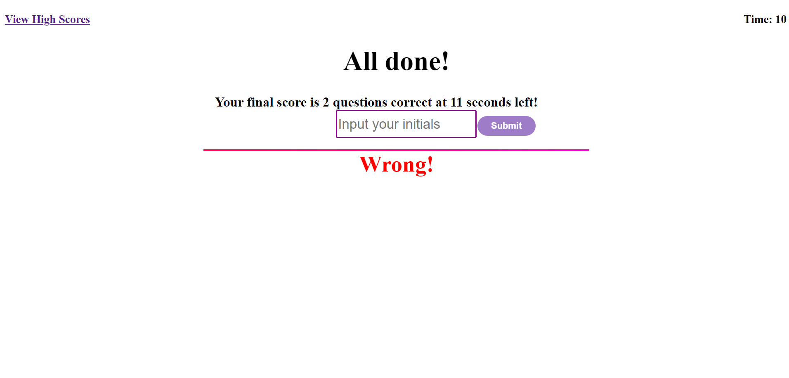

# Code Quiz

## Purpose

This coding quiz geared toward coding bootcamp students enables the user to answer eight questions based on Javascript.

## Coding Quiz Functionality

When the user begins the quiz, they will see a timer set to countdown from 75 seconds to zero seconds. The timer will start once the "Start Quiz" button is clicked.



At any moment, the user is able to click "View High Scores" to be taken to a page of their scores stored in localstorage. From there, they are given the options to click a button to either go back to the start of the quiz or to clear their scores.



After starting the quiz, the student will be taken through eight questions one-by-one which will display "Correct!" or "Wrong!" if the user answers correctly or incorrectly respectively. 




Once the user finishes answering all the questions or the countdown reaches 0, the quiz is over and the user is prompted to enter their initials to an input.  They can then click the "Submit" button to be taken to the high score page where their recent score will display along with their previous scores.  



They can then choose to either clear their list of scores from the local storage or to go back to the beginning of the quiz to retake it.

## Bonus Features:

To keep things interesting, my app comes with a CSS bonus of a gradient in the border line between the answers and the judgement. If the user is correct, the gradient shifts from green to purple, and if wrong, red to purple as displayed in the code below.

``` JS
if (selectedButton.hasAttribute("data")) {
            judgeEl.innerHTML = "Correct!";
            judgeEl.style.color= "green";
            judgeEl.style.borderTop = "4px solid";
                judgeEl.style.borderImageSource = "linear-gradient(45deg, rgb(0,220,96), rgb(250,165,242))";
                judgeEl.style.borderImageSlice = "1";
                judgeEl.style.marginTop = "20px";
            rightNumbers++;
            goNextQuestion(); 
        } else {
                timeDown -= 10;
                if (timeDown <= 0) {
                    currentQuestion = null;
                    timeDown = 0;
                    questionsEl.innerHTML = "";
                };
                judgeEl.innerHTML = "Wrong!";
                judgeEl.style.color = "red";
                judgeEl.style.borderTop = "4px solid";
                judgeEl.style.borderImageSource = "linear-gradient(45deg, rgb(250,24,84), rgb(234,22,200))";
                judgeEl.style.borderImageSlice = "1";
                judgeEl.style.marginTop = "20px";
                wrongNumbers++;
                goNextQuestion();  
            } 
```

## Future Enhancements:

I plan to add in the following features: 
1. Add more CSS to improve the overall UI aesthetic
2. Add a visual scoreboard that stays on the screen as the user takes the quiz


### Link to the deployed app
[Code Quiz App](https://kairora.github.io/code-quiz-hw-4/index.html)

### Link to the Repository
[Code Quiz Repo](https://github.com/kairora/code-quiz-hw-4)
